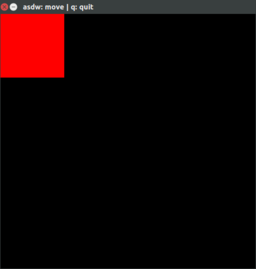
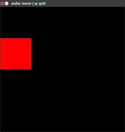
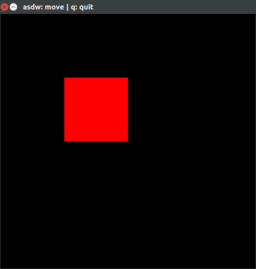

# Interactive

Interactive GUI demos with Verilator logic.

    make run RUN=move

1.  [About](about.md)
1.  and2
    1. [and2.cpp](and2.cpp)
    1. [and2.v](and2.v)
1.  move
    1. [move.cpp](move.cpp)
    1. [move.v](move.v)
1.   [display.cpp](display.cpp)
